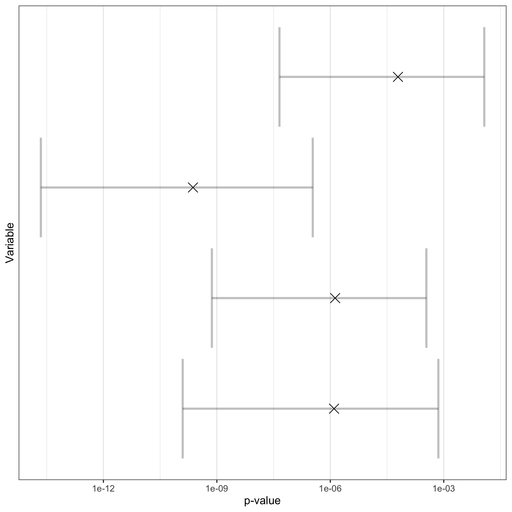

# False positives, p-hacking and multiple comparisons {#phacking}

<!---Paul -I have messed around with the permutations bit and am not 100% sure I have it right - in trying to explain it to others I realised I may have got the wrong end of the stick. 
But more generally, I think this chapter gets too complicated - particularly the material after the Bonferroni. Need to discuss how to handle it. It might be possible to simplify it further and just refer on to other sources. If there aren't good clear descriptions available, we could possibly could put it an appendix?
Another option would be to actually shift this stuff into Exercises at the end - i.e. flag up this is a more technical exercise, but point them to sources on BH and BY and get them to do some sums themselves? I think that way, people could treat it as optional for those who are more numerate.  
But I think the main thing is to get them to understand why p-hacking is a problem, and that you need to correct for multiple comparisons, without getting too bogged down in difficult stuff-->


```{r, echo=F,warning=F,message=F}
list_of_packages<-c("tidyverse","kableExtra","knitr","MASS")
new.packages <- list_of_packages[!(list_of_packages %in% installed.packages()[,"Package"])]
if(length(new.packages))install.packages(new.packages,dependencies = TRUE)

library(tidyverse)
library(kableExtra)
library(knitr)
library(MASS)
library(dplyr)
library(gtools) #for permutations

```

Let us look again at the table of possible outcomes that can arise if we use p-values to decide if a result is statistically significant or not, shown here as \@ref(table:confusionMat2a). In this chapter, our focus will be on the top right hand corner - the False Positive. 

  
```{r confusionMat2a, echo=FALSE, message=FALSE, warnings=FALSE,results='asis',tab.caption="Possible outcomes of Null Hypothesis Statistical Test"}
options(kableExtra.html.bsTable = T)
mymat<-matrix(NA,nrow=2,ncol=3)

mymat[,1]<-c("Reject Null hypothesis","Do Not Reject Null Hypothesis")

mymat[,2]<-c("True Positive","False Negative \n (Type II error)")
mymat[,3]<-c("False Positive \n (Type I error)","True Negative")

mymat<-as.data.frame(mymat)
names(mymat)<-c("","Intervention effective","Intervention ineffective")

knitr::kable(mymat,escape = F, align = "c", booktabs = T, caption = 'Outcomes of hypothesis test') %>%
  kable_styling(c("striped", "bordered"), latex_options = "striped", full_width = F) %>%
  column_spec(1:1, bold = T) %>%
  column_spec(1:3,width = "9em") %>%
  add_header_above(c(" ","Ground truth" = 2))
```


### Type I error

A **Type I error** is a **false positive**, which occurs when the null hypothesis is rejected but a true effect is not actually present. One useful mnemonic for distinguishing Type I and Type II errors is to think of the sequence of events in the fable of the boy who cried wolf. This boy lived in a remote village and he used to have fun running out to the farmers in the fields and shouting "Wolf! Wolf!" and watching them all run inside. The farmers were making an (understandable) Type I error, of concluding there was a wolf when in fact there was none.  One day, however, a wolf turned up. The boy ran into the fields shouting "Wolf! Wolf!" but nobody took any notice of him, because they were used to his tricks. Sadly, all the sheep got eaten because the villagers had made a Type II error, assuming there was no wolf when there really was one.  
<!-- dorothy to try and get a picture of boy who cried wolf-->

The type I error rate is controlled by setting the significance criterion, $\alpha=0.05$, at 5%, or sometimes more conservatively 1% ($\alpha=0.01$). With $\alpha=0.05$, on average 1 in 20 statistically significant results will be false positives; when it is .01, then 1 in 100 will be false positives. The .05 cutoff is essentially arbitrary, but very widely adopted in the medical and social sciences literature, though debate continues as to whether a different convention should be adopted [@benjamin2018, @lakens2018].  

### Reasons for false positives  

There is one obvious reason why researchers get false positive results: chance. It follows from the definition given above, that if you adopt an alpha level of .05, you will wrongly conclude that your intervention is effective in 1 in 20 studies.  This is why we should never put strong confidence in, or introduce major policy changes on the basis of, a single study. The probability of getting a false positive once is .05, but if you replicate your finding, then it is far more likely that it is reliable - the probability of two false positives in a row is .05 * .05 = 0025, or 1 in 400.  

Unfortunately, though, false positives and non-replicable results are far more common in the literature than they should be if our scientific method was working properly. One reason, which will be covered in Chapter \@ref(pubbias), is publication bias. Quite simply, there is a huge bias in favour of publishing papers reporting statistically significant results, with null results getting quietly forgotten.  

A related reason is a selective focus on positive findings _within_ a study. Consider a study where the researcher measures children's skills on five different measures, comprehension, expression, mathematics, reading, and motor skills, but only one of them, comprehension, shows a statistically significant improvement (p < .05) after intervention that involves general "learning stimulation". It may seem reasonable to delete the other measures from the write-up, because they are uninteresting. Alternatively, the researcher may report all the results, but argue that there is a good reason why the intervention worked for this specific measure. Unfortunately, this would be badly misleading, because the statistical test needed for a study with five outcome measures is different from the one needed for a single measure. Failure to understand this point is widespread - insofar as it is recognised as a problem, it is thought of as a relatively minor issue.  Let's look at this example in more detail to illustrate why it is so serious.  

We assume in the example above that the researcher would have been equally likely to single any one of the five measures, provided it gave p < .05, regardless of which one it was, and tell a good story about why the intervention was specifically effective with that task. If that is so, then interpreting a p-value for each individual measure is inappropriate, because the implicit hypothesis that is being tested is "do _any_ of these measures improve after intervention?". The probability of a false positive for any specific measure is 1 in 20, but the probability that _at least_ one measure gives a false positive result is higher.  We can work it out as follows:

- With $\alpha$ set to. 05, the probability that any one measure gives a _nonsignificant_ result = .95.
- The probability that *all five measures* give a _nonsignificant_ result is found by multiplying the probabilities for the five tasks:  .95 * .95 * .95 * .95 * .95 = .77.
- So it follows that the probability that _at least one_ measure gives a significant result (p-value < .05) is 1-.77 = .23.

In other words, with five measures to consider, the probability that _at least one of them_ will give us p < .05 is not 1 in 20 but 1 in 4. The more measures there are, the worse it gets.  We will discuss solutions to this issue below (see Multiple hypothesis testing).  

Psychologists have developed a term to talk about the increase in false positives that arises when people pick out results on the basis that they have a p-value of .05, regardless of the context - *p-hacking*. And another term, *HARKing*, or "hypothesising after the results are known" [@kerr1998] is used to describe the tendency to rewrite not just the Discussion but also the Introduction of a paper to fit the result that has been obtained. Sadly, researchers are not just unaware that these behaviours can dramatically increase the rate of false positives in the literature - they are often encouraged by senior figures to adopt exactly these practices: a notorious example is that of @bem2004.  Perhaps the most common error is to regard a p-value as a kind of inherent property of a result that reflects its importance regardless of context. In fact, context is absolutely key: a single p-value below .05 has a very different meaning in a study where you only had one outcome measure than in a study where you tested several measures in case _any_ of them gave an interesting result. 

A related point is that you should *never generate and test a hypothesis using the same data*. After you have run your study, you may be enthusiastic about doing further research with a specific focus on the comprehension outcome measure. That's fine, and in a new study with specific predictions about comprehension you could adopt $\alpha$ of .05 without any corrections. Problems arise when you subtly change your hypothesis _after seeing the data_ from "Do _any_ of these N measures show interesting results?" to "Does comprehension improve after intervention?", and apply statistics as if the other measures had not been considered.  

In clinical trials research, potential for p-hacking is in theory limited by a requirement for  registration of trial protocols, which should ensure that a primary outcome measure is identified before the study is started (see Chapter \@ref(prereg)).  This has not yet become standard for behavioural interventions, and in practice, clinical trial researchers often deviate from the protocol after seeing the results [@goldacre2019]. It is important to be aware of the potential for a high rate of false positives when multiple outcomes are included. 

Does this mean that only a single outcome can be included? The answer is no: It might be the case that the researcher requires multiple outcomes to determine the effectiveness of an intervention, for example, a quantity of interest might not be able to be measured directly, so several proxy measures are recorded to provide a composite outcome measure. But in this case, it is important to plan in advance how to conduct the analysis to avoid an increased rate of false positives. There are statistical options that involve a more complex multivariate analysis, but this in turn may require a substantially greater sample size. There is a danger that if too many outcomes are included, it becomes harder to find an effect of interest, because in controlling for potential false positives, we risk a high rate of type II errors - see Chapter \@ref(power).
 
Selection of one measure from among many is just one form of p-hacking. Another common practice has been referred to as the "garden of forking paths": the practice of trying many different analyses, including making subgroups, changing how variables are categorised, excluding certain participants post hoc, or applying different statistical tests, in the quest for something significant. This has all the problems noted above in the case of selecting from multiple measures, except it is even harder to make adjustments to the analysis to take it into account because it is often unclear exactly how many different analyses could potentially have been run. With enough analyses it is almost always possible to find something that achieves the magic cutoff of p < .05. 

This [animation](https://figshare.com/articles/figure/The_Garden_of_Forking_Paths/2100379) tracks how the probability of a "significant" p-value below .05 increases as one does increasingly refined analyses of hypothetical data investigating a link between handedness and ADHD - with data split according to age, type of handedness test, gender, and whether the child's home is rural or urban. The probability of finding at least one significant result is tracked at the bottom of the display. For each binary split, the number of potential contrasts doubles, so at the end of the path there are 16 potential tests that could have been run, and the probability of at _at least one_ "significant" result in one combination of conditions is .56. The researcher may see that a p-value is below .05 and gleefully report that they have discovered an exciting association, but if they were looking for _any_ combination of values out of numerous possibilities, then the p-value is highly misleading - in particular, it is _not_ the case that there is only a 1 in 20 chance of obtaining a result this extreme.   

There are several ways we can defend ourselves against a proliferation of false positives that results if we are too flexible in data analysis:  

- Pre-registration of the study protocol, giving sufficient detail of measures and planned analyses to prevent flexible analysis - or at least make it clear when researchers have departed from the protocol. We cover pre-registration in more detail in Chapter \@ref(prereg).  

- Using statistical methods to correct for multiple testing. Specific methods are discussed below. Note, however, that this is only effective if we correct for all the possible analyses that were considered.  

- "Multiverse analysis": explicitly conducting all possible analyses to test how particular analytic decisions affected results.  This is beyond the scope of this book, as it is more commonly adopted in non-intervention research contexts [@steegen2016] when analysis of associations between variables is done with pre-existing data sets.  


## Adjusting statistics for multiple hypothesis testing  

As noted above, even when we have a well-designed and adequately powered study, if we collect multiple outcome variables, or if we are applying multiple tests to the same data, then we increase our chance of finding a false positive. Remember that if we set $\alpha$ to .05 and apply $k$ tests to our data, then the probability of finding at least one false positive is given by $1-(1-\alpha)^{k}$. This is officially known as the family-wise error rate (FWER).  

```{r familywise,echo=F, fig.cap="Plot of relationship between familywse error rate and number of statistical tests"}
k <- seq(1:100)
FWE <- (1-(1-0.05)^k)
fwe_dat<-data.frame(FWE=FWE,k=k)
ggplot(data=fwe_dat,aes(k,FWE,type="l"))+geom_line(size=1.2,colour="blue")+theme_bw()+geom_segment(aes(x=10,y=0,xend=10,yend=0.4),linetype="dashed",size=1.2)+geom_segment(aes(x=0,y=0.4,xend=10,yend=0.4),linetype="dashed",size=1.2)+xlab("Number of tests, k")+ylab("Familywise Error (FWE)")

```

Figure \@ref(fig:familywise) shows the relationship between the familywise error rate and the number of tests conducted on the data. Note that the left-most point of the blue line corresponds to the case when we have just one statistical test, and the probability of a false positive is .05, exactly where we would expect. The dotted line shows the case where we performed 10 tests (k = 10), increasing our chance of obtaining a false positive to approximately 40%.  Clearly, the more tests applied, the greater the increase in the chance of at least one false positive result. Although it may seem implausible that anyone would conduct 100 tests, the number of implicit tests can rapidly increase if sequential analytic decisions multiply, as shown in the Garden of Forking Paths example, where we subdivided the analysis 4 times, to give 2^4 = 16 possible ways of dividing up the data. 


There are many different ways to adjust for the multiple testing in practice. We shall discuss some of the most commonly applied.

### Bonferroni Correction
The Bonferroni correction is both the simplest and most popular adjustment for multiple testing. The test is described as "protecting the type I error rate", i.e. if you want to make a false positive error only 1 in 20 studies, the Bonferroni correction specifies a new $\alpha$ level that is adjusted for the number of tests. The Bonferroni correction is very easy to apply: you just divide your desired false positive rate by the number of tests conducted.  

For example, say we had some data and wanted to run multiple t-tests between two groups on 10 outcomes, and keep the false positive rate at 1 in 20. The Bonferroni correction would adjust the $\alpha$ level to be 0.05/10 = 0.005, which would indicate that the true false positive rate would be $1-(1-\alpha_{adjusted})^{n} = 1-(1-0.005)^{10} = 0.049$ which approximates our desired false positive rate. So we now treat any p-values greater than .005 as non-significant. This successfully controls our type I error rate at approximately 5%.  

It is not uncommon for researchers to report results both with and without Bonferroni correction - using phrases such as "the difference was significant but did not survive Bonferroni correction". This indicates misunderstanding of the statistics. The Bonferroni correction is not some kind of optional extra in an analysis that is just there to satisfy pernickety statisticians. If it is needed - as will be the case when multiple tests are conducted in the absence of clear a priori predictions -  then the raw uncorrected p-values are not meaningful, and should not be reported. 

The Bonferroni correction is widely used due to its simplicity but it can be associated with a high rate of type II errors.

### False Discovery rate (FDR)
Methods based on the false discovery rate differ from the Bonferroni correction as they control the expected proportion of all positive results that are false positives, rather than the overall false positive rate. 

$FDR = \frac{False\ positive}{False\ positive\ +\ True\ positive}$

The difference between the FDR and the false positive rate is subtle. When we use a Bonferroni correction, we revise the significance level to try and ensure that only 1 in 20 experiments would give at least one false positive.  In contrast, when we set the FDR to 5%, this means that we expect that within any one experiment, 5% of the rejections of the null hypothesis will be wrong. Thus FDR is useful in cases where we are willing to accept more false positives to avoid having false negatives. 

We will present two common techniques that use a FDR procedure, Benjamini-Hochberg (BH), and Benjamini-Yekutieli (BY). The BH procedure can be summarized in four steps:

1. Sort a set of p-values from a set of multiple comparisons into ascending order.  
2. For each p-value, assign a rank. For example, the lowest p-value would be 1 and the second lowest would be 2, and so on.  
3. Next we need to calculate a BH critical value for each p-value. We use the formula, $(i/n)\alpha$, where $i$ is a particular p-value's rank; and $n$ is the number of tests.  
4. Original p-values are now compared against the BH critical values, finding the largest p-value that is smaller than the critical value.  

We can illustrate this procedure by looking at an example. We revisit the set of t-tests from our Bonferroni correction, where we concluded that only those tests with p < .005 would be regarded as significant. With the FDR approach, a different p-value is specified for each of the 10 ranked tests. For the most extreme result (rank 1), the critical p-value is the same as for the Bonferroni correction, i.e. in this case 1/10 or .005. Provided that criterion is met, we proceed to the second ranked p-value. This time, the critical value is 2/10 * .05 = .01. We proceed to compare obtained and critical p-values going down the ranked list. Note that when we get to the final ranked test, the critical p-value is 10/10 * .05 = .05, i.e. the same as our uncorrected alpha value. 

```{r BYexample, echo=F,message=F,warning=F,results="asis"}
options(kableExtra.html.bsTable = T)
P_val_tab<-data.frame(Variable=paste0("X",1:10),Rank=1:10,alpha=rep(0.05,10),p.value=c(0.002,0.004,0.008,0.012,0.023,0.041,0.054,0.091,0.12,0.2))
P_val_tab$BH<-(P_val_tab$Rank/10)*P_val_tab$alpha
P_val_tab$BY<-1:10

for(i in 1:10)
{
P_val_tab$BY[i]<-round((P_val_tab$Rank[i]/10)*(P_val_tab$alpha[i]/sum(1/seq(1:P_val_tab$Rank[i]))),3)
}
P_val_tab %>%
  mutate(BH = cell_spec(BH, color = "black", 
                    background = c(rep("#00FF00",4),rep("#FFFFFF",6))),
         Bonf. = cell_spec(alpha/10, color = "black", 
                    background = c(rep("#3399FF",2),rep("#FFFFFF",8))),
         BY = cell_spec(BY, color = "black", 
                    background = c(rep("#FF0000",3),rep("#FFFFFF",7)))) %>%
knitr::kable(escape = F,align = "c", booktabs = T,caption = "Corrected p-values using several different methods (Bonferroni, BH, BY)") %>%
  kable_styling(c("striped","condensed"), latex_options = "striped", full_width = F)
  
```

Table \@ref(tab:BYexample) shows the p-values obtained from t-tests on data obtained from the same participants on ten different outcome measures. If we ignore the fact that we are performing 10 tests, we might conclude that the first six variables (X1-X6) are statistically significant, but this would be misleading. Using the BH procedure, we find that only X1-X4 are statistically significant under a more robust FWER (green coloured cells). Had we chosen the more conservative Bonferroni correction, we would only find X1 and X2 remain statistically significant ($\alpha_{Bonf}=0.05/10=0.005$, blue coloured cells). The Benjamini-Hochberg test gives a higher false positive rate than the Bonferroni correction, but may be preferred in situations where the researcher is more concerned to limit the number of type II errors. It is sometimes preferred in situations where a large number of tests is conducted to select a subset of results for further testing. It does not, however, take into account correlations between outcome measures. 

Where we have correlated outcome measures, the Bonferroni correction is over-conservative. It's easiest to illustrate this with an extreme example. Imagine we have two measures of reading ability that are highly intercorrelated, with _r_ of .9. This means that the results from the two tests will be closely similar - and if one of the measures gives a significant result, it's likely that the other one will as well. In a case like this, if we applied the Bonferroni correction, we'd reduce our chances of detecting a true effect and have a high type II error rate; we'd be much better off just averaging the scores of the two measures and using the original uncorrected $\alpha$ of .05. The Benjamini-Yekutieli (BY) approach again relies on the False Discovery Rate, but unlike the Benjamini-Hochberg test it also allows for dependence between the tests (i.e. the tests are correlated; therefore, the p-values will also be correlated). The adjustment resembles the BH procedure, except that the alpha level is adjusted for the number of tests:  

$(i/n)(\frac{\alpha}{\sum_{i=1}^{k} 1/i})$

This formula is easiest to understand if it is broken down into two steps. First we add together a series of fractions representing the ranks: i.e. 1/1 + 1/2 + 1/3 etc, up to 1/n, where n is the number of tests. With 10 tests, the result is 2.92. Our alpha value, .05, is divided by this value to give an adjusted alpha of .05/2.92 = .0171. We then proceed as for the Benjamini-Hochberg method, specifying a different significance threshold for each p-value, in ranked order. 

**AARGH! I tried to explain this more, but then the values I get disagree with those in the table - though the last one does agree. Not sure what is wrong here.
I found this explanation in Excel reasonably easy to follow: https://www.real-statistics.com/hypothesis-testing/familywise-error/benjamini-hochberg-and-benjamini-yekutieli-tests/**

Table \@ref(tab:BYexample) shows the p values that remain statistically significant under the Benjamini-Yekutieli adjustment (coloured in red). In our example, the BY is more conservative than the BH but is less conservative than the Bonferroni.

<!---Note from DB. I am having difficulty understanding under what circumstances you would prefer BY to BH. And it seems I am not alone: https://stats.stackexchange.com/questions/63441/what-are-the-practical-differences-between-the-benjamini-hochberg-1995-and-t.  I wonder if we might *just* mention BY to keep this simple; it does seem that BY specifically addresses correlated outcome measures, which is of particular interest I think as this is a common thing in language intervention research.
I also think we might want to put this in as Custom Code as it is more technical - the formula will terrify most of our readers!-->

### Permutation methods  

In conventional applications of Null Hypothesis Significance Testing, we work out where to put the cutoff point corresponding to a particular p-value from knowledge of the normal distribution. If data are normally distributed, then a z-score of 1.64 corresponds to the 95% percentile - only 5% of people will get a score higher than this. Many of our common statistical methods *assume* we have normally distributed data, though this may not always be the case.  **Resampling** techniques offer a new perspective on correcting for multiple testing, in which we estimate the distribution of the null hypothesis from our observed data. The basic idea is that if we have participants from groups 1 and 2, we could shuffle them randomly and this gives us a way to estimate the distribution of scores under the null hypothesis. One benefit of this approach is that the statistical significance is estimated from the data, rather than from an abstract normal distribution, so this method can be applied with confidence even when data are non-normal. The general procedure is as follows:

1. Using the original data set, we compute the means for the two groups (I = intervention and C = control), and a test statistic and corresponding p-value are calculated.  
2. Next, we pool the two groups and permute (resample) the data to give two new groups of the same size as I and C, but with different allocation to the two groups, to represent a different permutation of I and C. To take a toy example, if we just had 3 people in group I, and 3 in group C, the 6 people could be divided into 2 groups in 20 ways:  

```{r permutations,echo=F,include=T}
z <- 1:6
mycomb<-combinations(6,3,z,repeats.allowed=F) 
#all permutations, but order within a group does not matter, so we need to crunch down, e.g. 123 456 is same as 123 465
I <- vector()
C <- vector()
for (i in 1:nrow(mycomb)){
  I <- c(I,paste0(mycomb[i,],collapse=""))
  cbit <- paste0(z[-mycomb[i,1:3]],collapse="")
  C <- c(C,cbit)
}

allcombs <- data.frame(cbind(I,C))
colnames(allcombs)<- c('Group I','Group C')

allcombs[2:19,] #Needs formatting - maybe just show top of table? Explain first row is actual allocation

```

In this example, for each of these 19 new ways of forming groups, we would calculate means, and the test statistic and associated p-value.  The idea is then to see how commonly we would find a p-value at least as small as the one obtained with the true allocation to groups.  In practice, with anything other than tiny sample sizes, the number of potential permutations of the data into two groups is enormous, and it could take days to run the tests.  Thus, rather than taking all permutations, a random sample of the possible groupings is considered (typically more than 1,000). Each time the test statistic and p-value are recorded. We then end up with a distribution of p-values - one from each permutation.  
4. We then count the proportion of permutations that give a p-value smaller than the p-value that was observed with the true allocation to groups. This is the empirical probability of obtaining a p-value that low when group allocation is made at random. 


```{r permutationstest,echo=F,message=F,warning=F,fig.width=5,fig.cap="Permutation distributions for individual tests"}
#This is slow to run and so output is saved to file; only need to run this if need to recreate figure.
makepermdemo <- 0 #set to 1 to recreate fig
if(makepermdemo ==1){
set.seed(123)

#generate some t-test data on 10 variables

mysig <- matrix(0.2,4,4)
diag(mysig) <- 1

permdata<-mvrnorm(100,rep(0,4),mysig)
permdata<-as.data.frame(permdata)
permdata$group<-factor(rep(c(1,2),50))
permdata[permdata$group=="2",1:4] <-permdata[permdata$group=="2",1:4]+1
permdata$ID<-1:100

actual_pval <- vector(mode="numeric",4)
  for (j in 1:4) 
{
    t <- t.test(permdata[permdata$group=="1",j],permdata[permdata$group=="2",j], alternative="two.sided")
    actual_pval[j] <- t$p.value
  }

myp<-data.frame(pvalue=actual_pval,x=1:4)

#-------------------------------------------------------------#

niter <- 1000
my_p <- data.frame(matrix(NA,nrow=niter,ncol=4))

for (i in 1:niter) {
  for (j in 1:4) {
    
    perm.g1s <- permdata %>% dplyr::select(paste0("V",j),group) %>% filter(group==1) %>% sample_n(50, replace=T)
    perm.g2s <- permdata %>% dplyr::select(paste0("V",j),group) %>% filter(group==2) %>% sample_n(50, replace=T)
    
        perm.test <- data.frame(g1=perm.g1s[,1],g2=perm.g2s[,1])
        t <- t.test(perm.test$g1, perm.test$g2, alternative="two.sided")
        my_p[i,j] <- t$p.value
  }
}

q <- apply(my_p, MARGIN = 2, quantile, probs = c(0.05, 0.5, 0.95))
q <- as.data.frame(t(q))
names(q) <- c("low","median","up")
q$Variable <- 1:4

ggplot(data=q,aes(median,Variable)) + geom_errorbarh(aes(xmin=low, xmax=up),size=1,alpha=0.25) +
scale_x_log10() + ylab("Variable") + xlab("p-value") + scale_y_continuous(breaks=NULL)+
geom_point(data=myp, aes(y=x,x=pvalue), size=4,shape=4)+theme_bw()
}
if (makepermdemo==0){
  
}

```

Suppose we have two groups of individuals and have measured language performance using three different instruments. We choose to use the Student's two independent samples t-test sequentially to test for differences between the two groups of individuals on each of the three measures. We have chosen not to use a correction that adjusts the p-values, instead we decide that a permutation approach will be more robust. Figure \@ref(fig:permutationstest) shows the result of our analysis using the permutation corrected t-tests. The cross points are the actual p-values of the t-tests on the original data. The 95% confidence intervals are constructed from the permuted distributions.  
<!---Comment from DB - I like this example, but it will need more basic explanation I think -->

## CLASS EXERCISE  

This [web-based app](https://www.shinyapps.org/apps/p-hacker/) by @schonbrodt2016 allows you to see how easy it can be to get a "significant" result by using flexible analyses. The term DV refers to "dependent variable", i.e. an outcome measure.  
- Set the True Effect slider to its default position of zero, which means that the Null Hypothesis is true - there is no true effect.  
- Set the Number of DVs set to 2.  
- Press "Run new experiment".  
- The display of results selects the variable with the lowest p-value and highlights it in green. It also shows results for the average of the variables, as DV_all. 
- Try hitting Run new experiment 20 times, and count on your fingers how often you get a p-value less than .05. With only two DVs, things are not so bad - on average you'll get two such values in 20 runs (though you may get more or less than this - if you are really keen, you could keep going for 100 runs to get a more stable estimate of the false positives).  
- Now set the number of DVs to 10 and repeat the exercise. You will probably run out of fingers on one hand to count the number of significant p-values.  

Felix Schönbrodt, who devised this website, allows you to go even further with p-hacking, showing how easy it is to nudge results into significance by using covariates (e.g. adjusting for age, SES, etc) or by excluding outliers. 

Note that if you enjoy playing with p-hacker, you can also use the app to improve your statistical intuitions about sample size and power. The app doesn't allow you to specify the case where there is only one outcome measure, which is what we really need in this case, so you have to just ignore all but one of the DVs. We suggest you just look at results for DV1. This time we'll assume you have a real effect. You can use the slider on True Effect to pick a value of Cohen's d, and you can also select the number of participants in each group. When you Run new experiment, you will find that it is difficult to get a p-value below .05 if the true effect is small and/or the sample size is small, whereas with a large sample and a big effect, a significant result is highly likely. 


<!-- possibly further exercise involving Bonferroni correction here-->