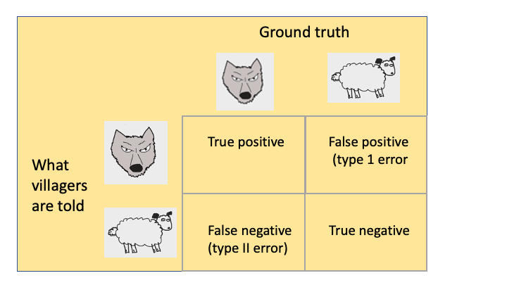

# False positives, p-hacking and multiple comparisons {#phacking}

<!---Paul - I think this chapter was too complicated - particularly the material after the Bonferroni. Need to discuss how to handle it. It might be possible to simplify it further and just refer on to other sources. 
I have substituted an alternative for the FDR/permutations material - see what you think.
But I think the main thing is to get them to understand why p-hacking is a problem, and that you need to correct for multiple comparisons, without getting too bogged down in difficult stuff-->
`r include_image("images/logo_alone_new.png")`


```{r, echo=F,warning=F,message=F}
list_of_packages<-c("tidyverse","kableExtra","knitr","MASS")
new.packages <- list_of_packages[!(list_of_packages %in% installed.packages()[,"Package"])]
if(length(new.packages))install.packages(new.packages,dependencies = TRUE)

library(tidyverse)
library(kableExtra)
library(knitr)
library(MASS)
library(dplyr)
library(gtools) #for permutations
library(flextable)

```

### Type I error

A **Type I error** is a **false positive**, which occurs when the null hypothesis is rejected but a true effect is not actually present. One useful mnemonic for distinguishing Type I and Type II errors is to think of the sequence of events in the fable of the boy who cried wolf. This boy lived in a remote village and he used to have fun running out to the farmers in the fields and shouting "Wolf! Wolf!" and watching them all get alarmed. The farmers were making an (understandable) Type I error, of concluding there was a wolf when in fact there was none.  One day, however, a wolf turned up. The boy ran into the village shouting "Wolf! Wolf!" but nobody took any notice of him, because they were used to his tricks. Sadly, all the sheep got eaten because the villagers had made a Type II error, assuming there was no wolf when there really was one.  This figure is really the same as Table 10.1 from the previous chapter, but redrawn in terms of wolves and sheep. 



The type I error rate is controlled by setting the significance criterion, $\alpha=0.05$, at 5%, or sometimes more conservatively 1% ($\alpha=0.01$). With $\alpha=0.05$, on average 1 in 20 statistically significant results will be false positives; when it is .01, then 1 in 100 will be false positives. The .05 cutoff is essentially arbitrary, but very widely adopted in the medical and social sciences literature, though debate continues as to whether a different convention should be adopted [@benjamin2018, @lakens2018].  

### Reasons for false positives  

There is one obvious reason why researchers get false positive results: chance. It follows from the definition given above, that if you adopt an alpha level of .05, you will wrongly conclude that your intervention is effective in 1 in 20 studies.  This is why we should never put strong confidence in, or introduce major policy changes on the basis of, a single study. The probability of getting a false positive once is .05, but if you replicate your finding, then it is far more likely that it is reliable - the probability of two false positives in a row is .05 * .05 = 0025, or 1 in 400.  

Unfortunately, though, false positives and non-replicable results are far more common in the literature than they should be if our scientific method was working properly. One reason, which will be covered in Chapter \@ref(pubbias), is publication bias. Quite simply, there is a huge bias in favour of publishing papers reporting statistically significant results, with null results getting quietly forgotten.  

A related reason is a selective focus on positive findings _within_ a study. Consider a study where the researcher measures children's skills on five different measures, comprehension, expression, mathematics, reading, and motor skills, but only one of them, comprehension, shows a statistically significant improvement (p < .05) after intervention that involves general "learning stimulation". It may seem reasonable to delete the other measures from the write-up, because they are uninteresting. Alternatively, the researcher may report all the results, but argue that there is a good reason why the intervention worked for this specific measure. Unfortunately, this would be badly misleading, because the statistical test needed for a study with five outcome measures is different from the one needed for a single measure. Failure to understand this point is widespread - insofar as it is recognised as a problem, it is thought of as a relatively minor issue.  Let's look at this example in more detail to illustrate why it is so serious.  

We assume in the example above that the researcher would have been equally likely to single any one of the five measures, provided it gave p < .05, regardless of which one it was, and tell a good story about why the intervention was specifically effective with that task. If that is so, then interpreting a p-value for each individual measure is inappropriate, because the implicit hypothesis that is being tested is "do _any_ of these measures improve after intervention?". The probability of a false positive for any specific measure is 1 in 20, but the probability that _at least_ one measure gives a false positive result is higher.  We can work it out as follows:

- With $\alpha$ set to. 05, the probability that any one measure gives a _nonsignificant_ result = .95.
- The probability that *all five measures* give a _nonsignificant_ result is found by multiplying the probabilities for the five tasks:  .95 * .95 * .95 * .95 * .95 = .77.
- So it follows that the probability that _at least one_ measure gives a significant result (p-value < .05) is 1-.77 = .23.

In other words, with five measures to consider, the probability that _at least one of them_ will give us p < .05 is not 1 in 20 but 1 in 4. The more measures there are, the worse it gets.  We will discuss solutions to this issue below (see Multiple testing).  

Psychologists have developed a term to talk about the increase in false positives that arises when people pick out results on the basis that they have a p-value of .05, regardless of the context - *p-hacking* [@simonsohn2014a]. @bishop2016 coined the term *ghost variable* to refer to a variable that was measured but was then not reported because it did not give significant results - making it impossible to tell that p-hacking had occurred. Another term, *HARKing*, or "hypothesising after the results are known" [@kerr1998] is used to describe the tendency to rewrite not just the Discussion but also the Introduction of a paper to fit the result that has been obtained. Sadly, many researchers are not unaware that these behaviours can dramatically increase the rate of false positives in the literature. Furthermore,  they may be encouraged by senior figures to adopt exactly these practices: a notorious example is that of @bem2004.  Perhaps the most common error is to regard a p-value as a kind of inherent property of a result that reflects its importance regardless of context. In fact, context is absolutely key: a single p-value below .05 has a very different meaning in a study where you only had one outcome measure than in a study where you tested several measures in case _any_ of them gave an interesting result. 

A related point is that you should *never generate and test a hypothesis using the same data*. After you have run your study, you may be enthusiastic about doing further research with a specific focus on the comprehension outcome measure. That's fine, and in a new study with specific predictions about comprehension you could adopt $\alpha$ of .05 without any corrections. Problems arise when you subtly change your hypothesis _after seeing the data_ from "Do _any_ of these N measures show interesting results?" to "Does comprehension improve after intervention?", and apply statistics as if the other measures had not been considered.  

In clinical trials research, potential for p-hacking is in theory limited by a requirement for  registration of trial protocols, which should ensure that a primary outcome measure is identified before the study is started (see Chapter \@ref(prereg)).  This has not yet become standard for behavioural interventions, and in practice, clinical trial researchers often deviate from the protocol after seeing the results [@goldacre2019]. It is important to be aware of the potential for a high rate of false positives when multiple outcomes are included. 

Does this mean that only a single outcome can be included? The answer is no: It might be the case that the researcher requires multiple outcomes to determine the effectiveness of an intervention, for example, a quantity of interest might not be able to be measured directly, so several proxy measures are recorded to provide a composite outcome measure. But in this case, it is important to plan in advance how to conduct the analysis to avoid an increased rate of false positives. There are statistical options that involve a more complex multivariate analysis, but this in turn may require a substantially greater sample size. There is a danger that if too many outcomes are included, it becomes harder to find an effect of interest, because in controlling for potential false positives, we risk a high rate of type II errors - see Chapter \@ref(power).
 
Selection of one measure from among many is just one form of p-hacking. Another common practice has been referred to as the "garden of forking paths": the practice of trying many different analyses, including making subgroups, changing how variables are categorised, excluding certain participants post hoc, or applying different statistical tests, in the quest for something significant. This has all the problems noted above in the case of selecting from multiple measures, except it is even harder to make adjustments to the analysis to take it into account because it is often unclear exactly how many different analyses could potentially have been run. With enough analyses it is almost always possible to find something that achieves the magic cutoff of p < .05. 

This [animation](https://figshare.com/articles/figure/The_Garden_of_Forking_Paths/2100379) tracks how the probability of a "significant" p-value below .05 increases as one does increasingly refined analyses of hypothetical data investigating a link between handedness and ADHD - with data split according to age, type of handedness test, gender, and whether the child's home is rural or urban. The probability of finding at least one significant result is tracked at the bottom of the display. For each binary split, the number of potential contrasts doubles, so at the end of the path there are 16 potential tests that could have been run, and the probability of at _at least one_ "significant" result in one combination of conditions is .56. The researcher may see that a p-value is below .05 and gleefully report that they have discovered an exciting association, but if they were looking for _any_ combination of values out of numerous possibilities, then the p-value is highly misleading - in particular, it is _not_ the case that there is only a 1 in 20 chance of obtaining a result this extreme.   

There are several ways we can defend ourselves against a proliferation of false positives that results if we are too flexible in data analysis:  

- Pre-registration of the study protocol, giving sufficient detail of measures and planned analyses to prevent flexible analysis - or at least make it clear when researchers have departed from the protocol. We cover pre-registration in more detail in Chapter \@ref(prereg).  

- Using statistical methods to correct for multiple testing. Specific methods are discussed below. Note, however, that this is only effective if we correct for all the possible analyses that were considered.  

- "Multiverse analysis": explicitly conducting all possible analyses to test how particular analytic decisions affected results.  This is beyond the scope of this book, as it is more commonly adopted in non-intervention research contexts [@steegen2016] when analysis of associations between variables is done with pre-existing data sets.  


## Adjusting statistics for multiple testing  

As noted above, even when we have a well-designed and adequately powered study, if we collect multiple outcome variables, or if we are applying multiple tests to the same data, then we increase our chance of finding a false positive. Remember that if we set $\alpha$ to .05 and apply $k$ tests to our data, then the probability of finding at least one false positive is given by $1-(1-\alpha)^{k}$. This is officially known as the family-wise error rate (FWER).  

```{r familywise,echo=F, fig.cap="Plot of relationship between familywse error rate and number of statistical tests"}
k <- seq(1:100)
FWE <- (1-(1-0.05)^k)
fwe_dat<-data.frame(FWE=FWE,k=k)
ggplot(data=fwe_dat,aes(k,FWE,type="l"))+geom_line(size=1.2,colour="blue")+theme_bw()+geom_segment(aes(x=10,y=0,xend=10,yend=0.4),linetype="dashed",size=1.2)+geom_segment(aes(x=0,y=0.4,xend=10,yend=0.4),linetype="dashed",size=1.2)+xlab("Number of tests, k")+ylab("Familywise Error (FWE)")

```

Figure \@ref(fig:familywise) shows the relationship between the familywise error rate and the number of tests conducted on the data. Note that the left-most point of the blue line corresponds to the case when we have just one statistical test, and the probability of a false positive is .05, exactly where we would expect. The dotted line shows the case where we performed 10 tests (k = 10), increasing our chance of obtaining a false positive to approximately 40%.  Clearly, the more tests applied, the greater the increase in the chance of at least one false positive result. Although it may seem implausible that anyone would conduct 100 tests, the number of implicit tests can rapidly increase if sequential analytic decisions multiply, as shown in the Garden of Forking Paths example, where we subdivided the analysis 4 times, to give 2^4 = 16 possible ways of dividing up the data. 


There are many different ways to adjust for the multiple testing in practice. We shall discuss the approaches that are most suitable for the context of intervention research.

### Bonferroni Correction
The Bonferroni correction is both the simplest and most popular adjustment for multiple testing. The test is described as "protecting the type I error rate", i.e. if you want to make a false positive error only 1 in 20 studies, the Bonferroni correction specifies a new $\alpha$ level that is adjusted for the number of tests. The Bonferroni correction is very easy to apply: you just divide your desired false positive rate by the number of tests conducted.  

For example, say we had some data and wanted to run multiple t-tests between two groups on 10 outcomes, and keep the false positive rate at 1 in 20. The Bonferroni correction would adjust the $\alpha$ level to be 0.05/10 = 0.005, which would indicate that the true false positive rate would be $1-(1-\alpha_{adjusted})^{n} = 1-(1-0.005)^{10} = 0.049$ which approximates our desired false positive rate. So we now treat any p-values greater than .005 as non-significant. This successfully controls our type I error rate at approximately 5%.  

It is not uncommon for researchers to report results both with and without Bonferroni correction - using phrases such as "the difference was significant but did not survive Bonferroni correction". This indicates misunderstanding of the statistics. The Bonferroni correction is not some kind of optional extra in an analysis that is just there to satisfy pernickety statisticians. If it is needed - as will be the case when multiple tests are conducted in the absence of clear a priori predictions -  then the raw uncorrected p-values are not meaningful, and should not be reported. 

The Bonferroni correction is widely used due to its simplicity but it can be over-conservative when our outcome measures are correlated. Nevertheless, for the kinds of scenario we might expect in an intevention context (where we may anticipate intercorrelations of around .4 to .6 for between measures) this does not have a very big effect. We illustrate this with some results of simulations, where we consider the case where we have either 2, 4, 6 or 8 outcome measures, which can range from being totally uncorrelated (r = 0), to strongly intercorrelated (r = .8). 

```{r simulated-corr,echo=F,include=T,tab.cap='Adjusted alpha-value to give 1 in 20 false positives for correlated outcome measures'}
mycorr <- c(0,.2,.4,.6,.8)
mynvar <- c(2,4,6,8,10,12)
maxn <- max(mynvar)
nsim <- 10000 #saved file has nsim of 10000

# SKIPSIM controls how this chunk works. 
# If skipsim is zero,we run all the simulation, which can take minutes
# If skipsim is 1, we read in big results from file instead, but still compute the summary tables
# NB the big results are NOT saved on github as they are too big, so they are read from local disk
# Set skipsim to 2 for fastest build; just the summaries are read from file, 
# These summaries are also saved on github.
skipsim <- 2

if(skipsim==0){
#dataframe to hold p-values for each variable, comparing A and B
resultsdf <- data.frame(matrix(NA,nrow=nsim*length(mycorr),ncol=maxn+2+length(mynvar)))
colnames(resultsdf) <-c('run','corr',paste0('V',1:maxn),paste0('minp',mynvar) ) 

summarydf <- data.frame(matrix(NA,nrow=length(mycorr),ncol=1+length(mynvar)))
colnames(summarydf) <-c('corr',paste0('N',mynvar) )    
thisrow <- 0
ES <- 0 #effect size; if positive then can use simulation to check power
for (s in 1:nsim){
  for (c in mycorr){
    thisrow <- thisrow+1
    resultsdf$run[thisrow] <- s
    resultsdf$corr[thisrow] <- c
      mysigma<-matrix(c,nrow=maxn,ncol=maxn)
      diag(mysigma)<-1
      A <- mvrnorm(n=100,mu=rep(0,maxn),Sigma=mysigma)
      B <- mvrnorm(n=100,mu=rep(ES,maxn),Sigma=mysigma)
           for (v in 1:maxn) {
             tempt <- t.test(A[,v],B[,v])
             resultsdf[thisrow,(v+2)]<-tempt$p.value
           }
   }
}
# we now have resultsdf, which is a big dataframe with p-values from all the simulations, for max N variables at all corrs.

# for each row, we need the lowest p-value for a subset of vars
# so we take 1st 2, then 1st 4, then 1st 6 and finally all vars 

for (i in 1:nrow(resultsdf)){
  thiscol <- ncol(resultsdf)-length(mynvar)
  for (n in mynvar){
    thiscol<-thiscol+1 #column to write to 
    resultsdf[i,thiscol]<-min(resultsdf[i,(2+(1:n))])
  }
}
write.csv(resultsdf,'data/rawsims_corr_vars_10000runs.csv',row.names=F)
}
if(skipsim==1){
  resultsdf <- read.csv('data/rawsims_corr_vars_10000runs.csv')
  #resultsdf is v large and is not saved on github
}

# we use this to populate summarydf, which holds critical alphas based on quantiles of p-values
# to check this, also create fpdf, which is similar but holds FP rate at .05
if(skipsim<2){
fpdf<-summarydf
thisrow <- 0
for (c in mycorr){
  thisrow<-thisrow+1
  colrange <- (ncol(resultsdf)-length(mynvar)+1):ncol(resultsdf)
  mybit <- resultsdf[resultsdf$corr==c,colrange] #select subset for this correlation
  thiscol<-0
  summarydf[thisrow,1]<-c
  fpdf[thisrow,1]<-c
  for (n in mynvar){
    thiscol<-thiscol+1
    plist <- mybit[,thiscol]
    fpdf[thisrow,(thiscol+1)]<-length(which(plist<.05))/length(plist)
    summarydf[thisrow,(thiscol+1)]<-quantile(plist,.05)
   
  }
}
write.csv(summarydf,'data/adj_alphas_corr_vars.csv',row.names=F)
write.csv(fpdf,'data/fprates_corr_vars.csv',row.names=F)
}
if(skipsim==2){
  summarydf <- read.csv('data/adj_alphas_corr_vars.csv')
  fpdf <- read.csv('data/fprates_corr_vars.csv')
}

ft <- flextable(round(summarydf,3))
ft <- set_caption(ft,'Adjusted alpha values for multiple (N) correlated variables to achieve false positive rate of 1 in 20')

ft
ft2 <- flextable(round(fpdf,3))
ft2 <- set_caption(ft2,'False positive rates if uncorrected alpha of .05 used with multiple correlated variables')
ft2
```
Table \@ref(tab:simulated-corr) shows the significance threshold that we'd need to use to get a false positive rate of 1 in 20, if there are either 2, 4, 6, 8, 10 or 12 correlated outcome variables. The top row shows the case for uncorrelated variables, and the significance cutoffs are very close to those that you would get by just applying the Bonferroni correction. As the average correlation between outcomes (shown in the left-most column) increases, the adjusted significance level becomes somewhat less severe, but in practice we can see that for realistic scenarios in an intervention study, the difference is not large. Researchers could be justified in substituting the significance cutoffs from Table \@ref(tab:simulated-corr) for the Bonferroni correction, but it is unlikely to make a large difference to outcomes.  

We used the same simulated data to compute the false positive rate that would arise if the researcher just ignored the problems of running tests on multiple measures. The lower section of Table \@ref(tab:simulated-corr) reinforces the importance of adopting a statistical correction, rather than assuming it is acceptable to stick with the .05 significance level while running tests on many outcome measures. For instance, with 6 outcome measures that are intercorrelated at r = .2, the probability of a false positive result is .254.  

We have focused on the case where multiple measures are taken, and *at least one* meets the conventional significance threshold of p = .05. What, though, if several measures meet that criterion? This is not uncommon in many intervention contexts, where a range of outcomes is assessed, with the expectation that the intervention may affect some or all of them, even if the researcher is unclear as to which is most likely to show the effect. Furthermore, in intervention research, the outcomes are likely to be positively intercorrelated. So suppose we have 10 outcome measures, and 5 of them give p < .05, but are above the Bonferroni corrected threshold of .005. Should we just ignore this evidence and accept the null hypothesis?

The Bonferroni correction is too harsh in such a situation. Various statistical approaches have been taken to address this issue. Here, we use simple simulations of null data to discover how  many measures would need to achieve the .05 significance level for us to be reasonably confident in rejecting the null hypothesis, depending on the number of outcomes considered, and the average correlation between them.  
<!--Paul - I can't believe others have not taken this approach, but I can't find anything. It is reasonably straightforward to simulate, and I think is much easier for nonstatisticians to understand than conventional FDR approaches-->.

```{r ranked-p, echo=F}
#We will rank order the p-values; need to do this for each N outcomes separately. 
#For instance, if there are 4 outcomes, we rank order the p-values for V1 to V4, and store the 2nd to 4th values in p4.2 to p4.4. (We already have the lowest p-value done for the previous block).
#If there are 8 outcomes, we rank order the p-values for V1 to V8, and store the 2nd to 8th values in p8.2 to p8.8. 

#We use the same enormous file of simulated data as before - nb this is NOT saved in github so needs to be on local drive if we use skipsim values of > 0 to speed up the build.
if(skipsim ==1){
resultsdf <- read.csv('data/rawsims_corr_vars_10000runs_plus.csv')
}

#The next chunk is very slow - about 30 mins - to run. The results file with the columns added from this step is now saved on drive, and can therefore be read in (has _plus suffix). 
#For skipsim 2, we just go directly to saved summary files for quicker build
if (skipsim<2){
#We will add columns to create for each N a ranked list of pvalues. 

mynvar <- c(2,4,6,8,10,12)
nucols <- c('p2.2','p4.2','p4.3','p4.4','p6.2','p6.3','p6.4','p6.5','p6.6','p8.2','p8.3','p8.4','p8.5','p8.6','p8.7','p8.8','p10.2','p10.3','p10.4','p10.5','p10.6','p10.7','p10.8','p10.9','p10.10','p12.2','p12.3','p12.4','p12.5','p12.6','p12.7','p12.8','p12.9','p12.10','p12.11','p12.12')
resultsdf[,nucols]<-NA
colstart<-which(colnames(resultsdf)=='p2.2')-1 #we will increment colcounter when new value added
for (i in 1:nrow(resultsdf)){
  colcounter<-colstart
  mycols <- c("V1","V2","V3","V4","V5","V6","V7","V8","V9","V10","V11","V12")
  thisp <- resultsdf[i,mycols]
  for (j in mynvar){
    thatp <- thisp[1:j]
    for (k in 2:j){
      colcounter<-colcounter+1
      resultsdf[i,colcounter]<-thatp[order(thatp)[k]]
    }
  }
}


#now we can compute quantiles for these new columns - this step is also skipped if skipsim=2
mycorr <- unique(resultsdf$corr)
colrange <- (colstart+1):ncol(resultsdf) #range of columns in resultsdf holding the pvalues we need

mynewcols <- colnames(resultsdf)[colrange]
fpdf2 <- data.frame(matrix(NA,nrow=length(mycorr),ncol=1+length(mynewcols)))
colnames(fpdf2) <-c('corr',mynewcols) #file to hold fp rates


thisrow <- 0 
  for (c in mycorr){
    thisrow<-thisrow+1

    fpdf2[thisrow,1]<-c
    mybit <- resultsdf[resultsdf$corr==c,colrange] #select subset for this correlation

  for (n in 1:length(mynewcols)){
    thiscol<-n
    plist <- mybit[,thiscol] #so if n is 1, this will be all the p-values at this correlation for the 2nd ranked variable in a case with 2 variables.
    fpdf2[thisrow,(thiscol+1)]<-length(which(plist<.05))/length(plist) #false positive rate

  }
  }

write.csv(fpdf2,'data/fpdf2.csv')
}

if(skipsim==2){
fpdf2 <- read.csv('data/fpdf2.csv')
}
#We now just want a little table that gives the N outcomes that need to be p < .05 for overall FP rate to be maintained
shorttab<- data.frame(matrix(NA,nrow=length(mycorr),ncol=1+length(mynvar)))
colnames(shorttab) <-c('corr',paste0('N',mynvar)) #file to hold N significant
shorttab[,1]<-mycorr
for (j in 1:length(mycorr)){
for (i in 1:length(mynvar)){
  mysize <- mynvar[i]
  fcol <-  which(colnames(fpdf2)== paste0('p',mysize,".2"))
  fcols <- fcol:(fcol+mysize-2)
  w<-min(which(fpdf2[j,fcols]<.05))
  w<-w+1
  if (w>mysize){w<-mysize}
    shorttab[j,(i+1)]<-w
}
}
```

```{r minN,echo=F,include=T,tab.cap='Minimum number of outcomes with p < .05 that retains false positive rate at 1 in 20, depending on N outcomes'}
ft <- flextable(shorttab)
ft
```

Values in the body of Table \@ref(tab:minN) indicate the minimum number of outcomes that would need to be significant at the .05 level to retain a 1 in 20 false positive rate for various scenarios. For instance, with six outcome measures (N6) that had an average intercorrelation of .4, then if two or more of them gave a significant intervention effect at p < .05, this would be sufficient evidence to reject the null hypothesis. The more outcomes are considered, the greater the number that would be required to be significant in order to reject the null hypothesis using the significance criterion of .05.  


## Class exercise 

This [web-based app](https://www.shinyapps.org/apps/p-hacker/) by @schonbrodt2016 allows you to see how easy it can be to get a "significant" result by using flexible analyses. The term DV refers to "dependent variable", i.e. an outcome measure.  
- Set the True Effect slider to its default position of zero, which means that the Null Hypothesis is true - there is no true effect.  
- Set the Number of DVs set to 2.  
- Press "Run new experiment".  
- The display of results selects the variable with the lowest p-value and highlights it in green. It also shows results for the average of the variables, as DV_all.  

- Try hitting Run new experiment 20 times, and keep a tally of how often you get a p-value less than .05. With only two DVs, things are not so bad - on average you'll get two such values in 20 runs (though you may get more or less than this - if you are really keen, you could keep going for 100 runs to get a more stable estimate of the false positives).  
- Now set the number of DVs to 10 and repeat the exercise. You will probably run out of fingers on one hand to count the number of significant p-values.  

Felix Schönbrodt, who devised this website, allows you to go even further with p-hacking, showing how easy it is to nudge results into significance by using covariates (e.g. adjusting for age, SES, etc) or by excluding outliers. 

Note that if you enjoy playing with p-hacker, you can also use the app to improve your statistical intuitions about sample size and power. The app doesn't allow you to specify the case where there is only one outcome measure, which is what we really need in this case, so you have to just ignore all but one of the DVs. We suggest you just look at results for DV1. This time we'll assume you have a real effect. You can use the slider on True Effect to pick a value of Cohen's d, and you can also select the number of participants in each group. When you Run new experiment, you will find that it is difficult to get a p-value below .05 if the true effect is small and/or the sample size is small, whereas with a large sample and a big effect, a significant result is highly likely. 


<!-- possibly further exercise involving Bonferroni correction here-->